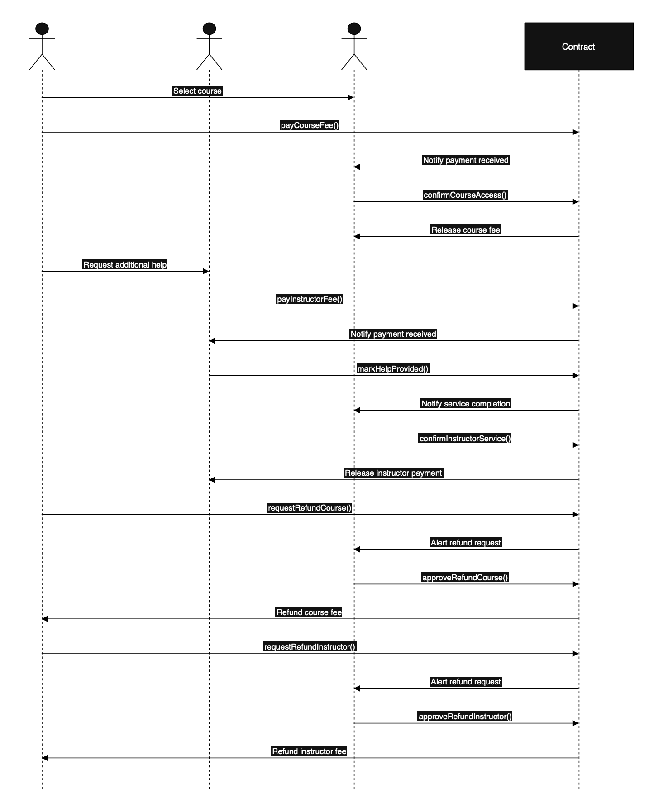

#kontraktas_blockchain

MODELIS: Kursų platforma su papildomu instruktoriaus samdymu

Veikėjai:
Studentas — perka kursus ir gali papildomai nusisamdyti instruktorių.  
Instruktorius — teikia papildomą pagalbą studentui už mokestį.  
Kursų platforma — kursų pardavėjas / tarpininkas (gauna mokėjimą už kursą, nurodo instruktorius, patvirtina kursų užbaigimą). 

Pagrindiniai procesai: 
Studentas perka kursą, sumoka už kursus per smart contract (escrow).
Platforma gauna pinigus, kai studentas patvirtina, kad gavo prieigą.
Studentas gali pasirinktinai samdyti instruktorių.
Studentas perveda papildomą mokestį į kontraktą.
Instruktorius gauna išmoką, kai platforma patvirtina, kad konsultacija įvyko.
Platforma patvirtina kursų suteikimą / instruktoriaus edukacinę paslaugą
Patvirtinimas aktyvuoja mokėjimą Instruktoriui arba Platformai.
Refund galimybė
Jei Studentas negauna prieigos per X laiką → jam grąžinami pinigai.
Jei Instruktorius neatlieka darbo → studentas gauna grąžinimą.

procesų scenarijai:

Scenarijus A:

Kursų pirkimas 
Studentas pasirenka kursą. 
Studentas sumoka kontraktui (escrow). 
Platforma suteikia prieigą prie kurso (įkelia hash/URL). 
Studentas patvirtina, kad prieiga gauta. 
Kontraktas perveda sumą Platformai. 

Scenarijus B: 

Instruktoriaus samdymas 
Studentas pasirenka instruktorių. 
Studentas sumoka už konsultacijas į kontraktą. 
Instruktorius atlieka paslaugą. 
Platforma patvirtina paslaugos atlikimą. 
Kontraktas išmoka instruktoriui. 

Scenarijus C: Refund (grąžinimai) 
Jei platforma nesuteikia prieigos per X laiką → Student gauna refund. 
Jei instruktorius neatlieka darbo per X laiką → Student gauna refund.  
Platforma gali nuskaityti dalį mokesčio (jei norima).  

### Course State
| State pavadinimas      | Reikšmė                                               
| ---                    | ---                                                   
| CourseCreated          | Studentas pasirinko kursą            
| CoursePaid             | Studentas sumokėjo mokestį už kursą                            
| CourseAccessGranted    | Platforma suteikė prieigą                             
| CourseCompleted        | Studentas patvirtino, kad gavo prieigą / kursai užbaigti 
| CourseRefunded         | Grąžinimas studentui                                  
| CourseClosed           | Kurso galiojimo laiko pabaiga                                    

### Instructor State
| State pavadinimas      | Reikšmė                                               
| ---                    | ---                                                   
| InstructorNotHired     | Studentas nenusisamdė instruktoriaus                 
| InstructorHired        | Studentas sumokėjo instruktoriaus mokestį              
| HelpProvided           | Instruktorius pažymėjo, kad paslauga suteikta         
| InstructorConfirmed    | Platforma patvirtino intruktoriaus paslaugą                         
| InstructorRefunded     | Studentui grąžinta suma                               
| InstructorPaid         | Instruktorius gavo apmokėjimą  

### Course — Student Actions
| Function                  | Kas daro                                               | Kas gali vykdyti |
| ---                      | ---                                                   | ---             |
| payCourseFee()           | Studentas apmoka kursą (ETH siunčiama į escrow)       | Student         |
| confirmCourseReceived()  | Studentas patvirtina, kad gavo prieigą                | Student         |
| requestRefundCourse()    | Studentas prašo grąžinimo, jei platforma nesuteikė paslaugos | Student |

### Course — Platform Actions
| Function                  | Kas daro                                               | Kas gali vykdyti |
| ---                      | ---                                                   | ---             |
| confirmCourseAccess()    | Platforma patvirtina, kad prieiga suteikta            | Platform        |
| approveRefundCourse()    | Platforma patvirtina grąžinimą                        | Platform        |
| withdrawCoursePayment()  | Platforma pasiima mokėjimą po patvirtinimo            | Platform        |

### Instructor-related — Student Actions
| Function                  | Kas daro                                               | Kas gali vykdyti |
| ---                      | ---                                                   | ---             |
| payInstructorFee()       | Studentas sumoka instruktoriaus mokestį               | Student         |
| requestRefundInstructor()| Studentas prašo grąžinti, jei paslauga nesuteikta     | Student         |

### Instructor-related — Instructor Actions
| Function                  | Kas daro                                               | Kas gali vykdyti |
| ---                      | ---                                                   | ---             |
| markHelpProvided()       | Instruktorius pažymi, kad konsultacija įvyko          | Instructor      |

### Instructor-related — Platform Actions
| Function                  | Kas daro                                               | Kas gali vykdyti |
| ---                      | ---                                                   | ---             |
| confirmInstructorService() | Platforma tvirtina instruktoriaus paslaugą           | Platform        |
| approveRefundInstructor()  | Platforma patvirtina instruktoriaus grąžinimą        | Platform        |
| withdrawInstructorPayment() | Instruktorius pasiima mokėjimą                       | Instructor      |

