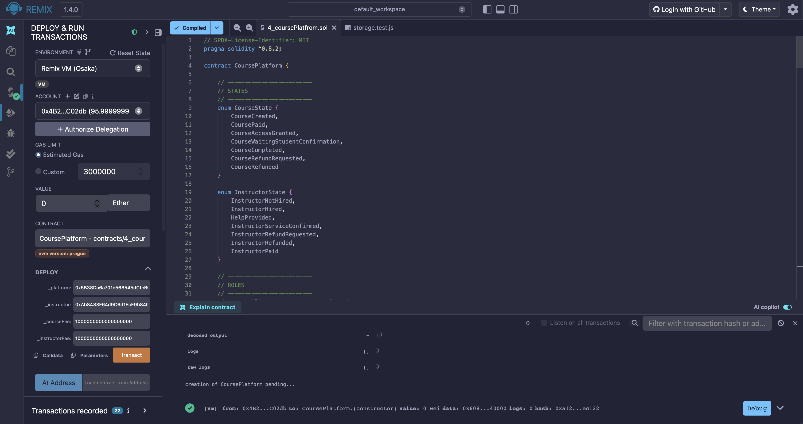
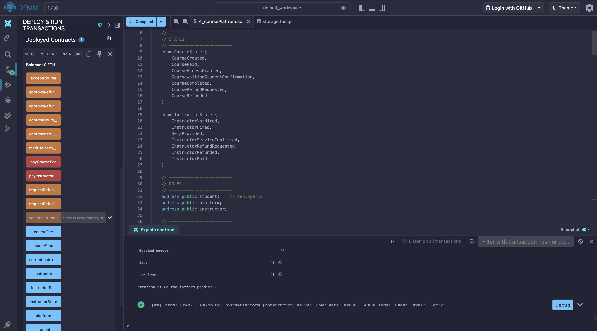

#kontraktas_blockchain

MODELIS: Kursų platforma su papildomu instruktoriaus samdymu

Veikėjai:
Studentas — perka kursus ir gali papildomai nusisamdyti instruktorių.  
Instruktorius — teikia papildomą pagalbą studentui už mokestį.  
Kursų platforma — kursų pardavėjas / tarpininkas (gauna mokėjimą už kursą, nurodo instruktorius, patvirtina kursų užbaigimą). 

Pagrindiniai procesai: 
Studentas perka kursą, sumoka už kursus per smart contract (escrow). 
Platforma gauna pinigus, kai studentas patvirtina, kad gavo prieigą. 
Studentas gali pasirinktinai samdyti instruktorių. 
Studentas perveda papildomą mokestį į kontraktą. 
Instruktorius gauna išmoką, kai platforma patvirtina, kad konsultacija įvyko. 
Platforma patvirtina kursų suteikimą / instruktoriaus edukacinę paslaugą 
Patvirtinimas aktyvuoja mokėjimą Instruktoriui arba Platformai. 
Refund galimybė 
Jei Studentas negauna prieigos per X laiką → jam grąžinami pinigai. 
Jei Instruktorius neatlieka darbo → studentas gauna grąžinimą. 

procesų scenarijai:

Scenarijus A:

Kursų pirkimas 
Studentas pasirenka kursą. 
Studentas sumoka kontraktui (escrow). 
Platforma suteikia prieigą prie kurso (įkelia hash/URL). 
Studentas patvirtina, kad prieiga gauta. 
Kontraktas perveda sumą Platformai. 

Scenarijus B: 

Instruktoriaus samdymas 
Studentas pasirenka instruktorių. 
Studentas sumoka už konsultacijas į kontraktą. 
Instruktorius atlieka paslaugą. 
Platforma patvirtina paslaugos atlikimą. 
Kontraktas išmoka instruktoriui. 

Scenarijus C: Refund (grąžinimai) 
Jei platforma nesuteikia prieigos per X laiką → Student gauna refund. 
Jei instruktorius neatlieka darbo per X laiką → Student gauna refund.  

### Course State
| State pavadinimas      | Reikšmė                                               
| ---                    | ---                                                   
| CourseCreated          | Studentas pasirinko kursą            
| CoursePaid             | Studentas sumokėjo mokestį už kursą                            
| CourseAccessGranted    | Platforma suteikė prieigą   
| CourseWaitingStudentConfirmation | platforma laukia studento patvirtinimo
| CourseCompleted        | Studentas patvirtino, kad gavo prieigą / kursai užbaigti 
| CourseRefundRequested  | Studentas pasirenka atsisakyti kursų
| CourseRefunded         | Grąžinimas studentui                                  
                                 

### Instructor State
| State pavadinimas      | Reikšmė                                               
| ---                    | ---                                                   
| InstructorNotHired     | Studentas nenusisamdė instruktoriaus                 
| InstructorHired        | Studentas sumokėjo instruktoriaus mokestį              
| HelpProvided           | Instruktorius pažymėjo, kad paslauga suteikta         
| InstructorServiceConfirmed    | Platforma patvirtino intruktoriaus paslaugą  
| InstructorRefundRequested | Studentas pasirenka atsisakyti instruktoriaus paslaugų
| InstructorRefunded     | Studentui grąžinta suma                               
| InstructorPaid         | Instruktorius gavo apmokėjimą  

### Course — Student Actions
| Function                  | Kas daro                                               | Kas gali vykdyti |
| ---                      | ---                                                   | ---             |
| payCourseFee()           | Studentas apmoka kursą (ETH siunčiama į escrow)       | Student         |
| acceptCourse()  | Studentas patvirtina, kad gavo prieigą                | Student         |
| requestRefundCourse()    | Studentas prašo grąžinimo, jei platforma nesuteikė paslaugos | Student |

### Course — Platform Actions
| Function                  | Kas daro                                               | Kas gali vykdyti |
| ---                      | ---                                                   | ---             |
| confirmCourseAccess()    | Platforma patvirtina, kad prieiga suteikta            | Platform        |
| approveRefundCourse()    | Platforma patvirtina grąžinimą                        | Platform        |

### Instructor-related — Student Actions
| Function                  | Kas daro                                               | Kas gali vykdyti |
| ---                      | ---                                                   | ---             |
| payInstructorFee()       | Studentas sumoka instruktoriaus mokestį               | Student         |
| requestRefundInstructor()| Studentas prašo grąžinti, jei paslauga nesuteikta     | Student         |

### Instructor-related — Instructor Actions
| Function                  | Kas daro                                               | Kas gali vykdyti |
| ---                      | ---                                                   | ---             |
| markHelpProvided()       | Instruktorius pažymi, kad konsultacija įvyko          | Instructor      |

### Instructor-related — Platform Actions
| Function                  | Kas daro                                               | Kas gali vykdyti |
| ---                      | ---                                                   | ---             |
| confirmInstructorService() | Platforma tvirtina instruktoriaus paslaugą           | Platform        |
| approveRefundInstructor()  | Platforma patvirtina instruktoriaus grąžinimą        | Platform        |

4. Užduotis: Realizuokite pirmąjame žingsnyje aprašytą verslo logiką išmanioje sutartyje Solidyti kalboje.  

Contracts folderyje susikūriau naują sol failą ir ten įsikėliau savo išmanų kontraktą.  
Sukompiliavau, sudėjau platformos, intruktoriaus adresus ir gwei sumas už paslaugas.  
Deployinau 

